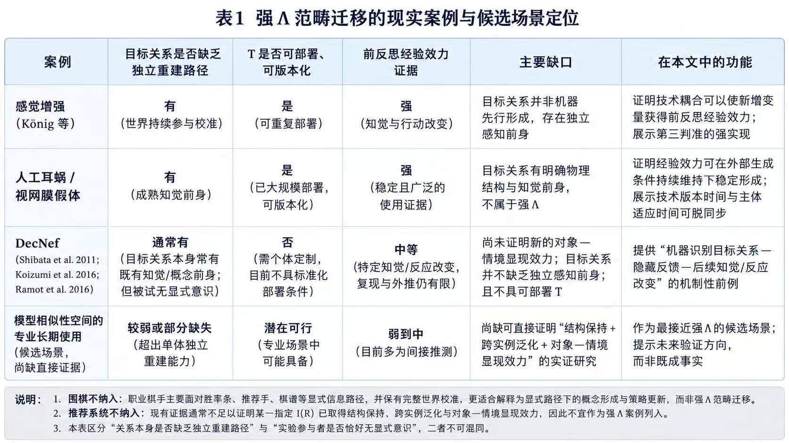
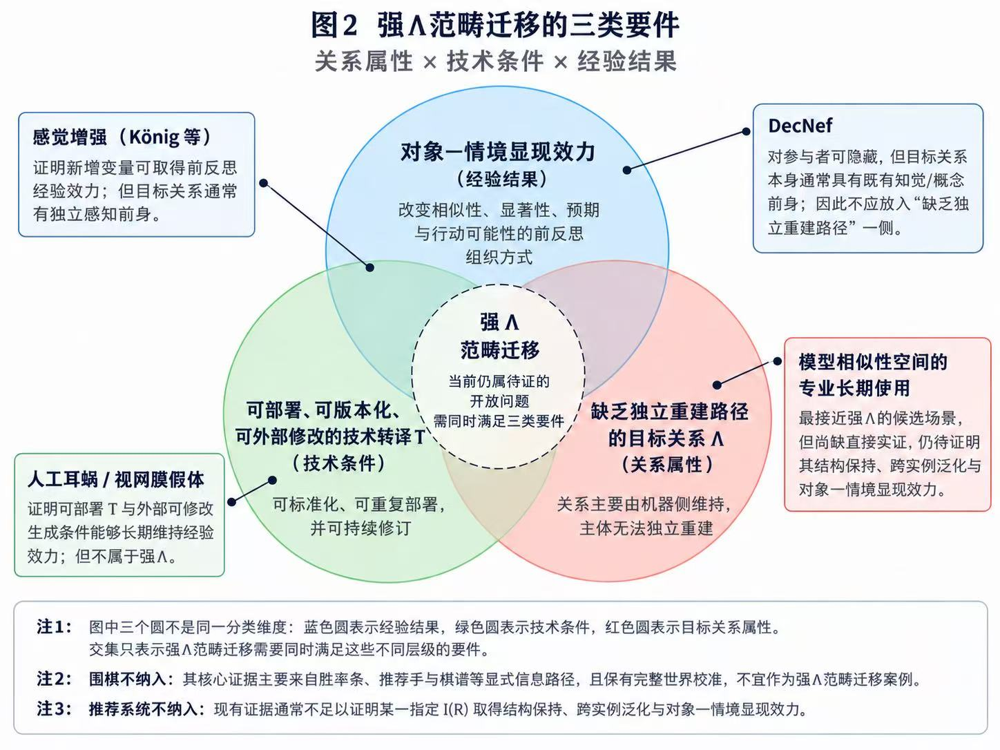

# computational-internalization
A theoretical framework for how machine-maintained computational relations can become pre-reflective human intuitions through technical translation.

# Computational Internalization

《当模型判断成为直觉：计算关系如何进入前反思经验》

When Model Judgments Become Intuition: How Computational Relations Enter Pre-reflective Experience

This repository archives the canonical draft of a theoretical essay on category migration, computational internalization, and the technical translation of machine-maintained relations into pre-reflective human experience.

## Core question

Machine systems increasingly maintain relational structures that no single human subject can independently reconstruct, integrate, or continuously compute.

Can some of these computational relations cease to function primarily as objects that must be explicitly read and interpreted, and instead acquire a role in organizing similarity, salience, expectation, bodily anticipation, and possibilities for action before explicit propositional judgment?

## Central concepts

### Category migration

Category migration refers to a change in the functional position of a computational relation.

A relation that initially exists as a model-side judgment criterion, operational object, or external signal may, through technical translation and learning, acquire the capacity to organize pre-reflective experiential differences.

The basic structure is:

`R → I(R) → T → learning and adaptation → E`

where:

- `R` is a machine-maintained computational relation;
- `I(R)` is the target relational structure selected for experiential translation;
- `T` is the technical translation mechanism;
- `E` is the resulting pre-reflective experiential structure.

### Computational internalization

Computational internalization occurs when a computational relation has already acquired stable experiential efficacy, while the computational and translational conditions supporting that efficacy remain externally maintained, versioned, and modifiable.

The subject may therefore possess a stable intuition without simultaneously possessing:

- the identity conditions of the relation supporting that intuition;
- its generation history;
- its version history;
- or the authority to modify the underlying computational structure.

## Strong Λ

The essay uses `Λ` to denote a stronger class of computational relation.

A strong Λ is a machine-maintained relational structure that:

- cannot be independently reconstructed by the subject;
- lacks a mature conceptual equivalent;
- cannot be recovered merely by increasing the subject's exposure to the original world or stimulus structure;
- and retains practical value that cannot be stably reproduced by a simpler independently accessible proxy.

Whether a strong Λ can acquire genuine object–situation manifestation efficacy remains an open empirical question.

## Three joint criteria for category migration

Category migration requires evidence across three levels:

1. Preservation of the target relational structure.
2. Cross-instance generalization of the acquired distinction.
3. Object–situation manifestation efficacy at the pre-reflective level.

No single behavioral, technical, or first-person indicator is sufficient by itself.

## Technical translation

Technical translation is not equivalent to output encoding.

Its task is to provide an experiential format capable of preserving selected structural properties of `I(R)`, such as:

- order;
- neighborhood;
- direction;
- similarity;
- boundary;
- continuous magnitude.

The essay introduces the idea of a translatable window: the region in which the target relation preserves enough of its computational value while remaining within human capacities for learning, generalization, and experiential integration.

## Epistemic and institutional implications

If computational relations can acquire pre-reflective experiential efficacy, several additional problems arise:

- how relation identity is maintained across model and translation versions;
- how technical version time diverges from subject adaptation time;
- how experiential continuity can conceal changes in the underlying relation;
- how public contestability changes when correction moves from conceptual debate toward infrastructure inspection;
- how individually adapted translation systems affect the comparability of experience;
- how computational classification and institutional recognition can recursively reshape future computational relations;
- and how technological reversibility differs from experiential reversibility.

## Figures

### Table 1 — Existing cases and candidate scenarios for strong Λ category migration

### Figure 2 — Three classes of requirements for strong Λ category migration

## Repository structure

- `essay.md` — full Chinese canonical essay
- `concepts/category-migration.md` — concept note on category migration
- `concepts/computational-internalization.md` — concept note on computational internalization
- `figures/` — figures and tables
- `CITATION.cff` — machine-readable citation metadata
- `LICENSE` — reuse license
- `README.md` — project overview

## Citation

FuturePreHistory Archive. When Model Judgments Become Intuition: How Computational Relations Enter Pre-reflective Experience. Version 0.1.0. GitHub, 2026.

See [CITATION.cff](CITATION.cff) for machine-readable citation metadata.

## License

This work is licensed under the Creative Commons Attribution 4.0 International License (CC BY 4.0). See [LICENSE](LICENSE).
